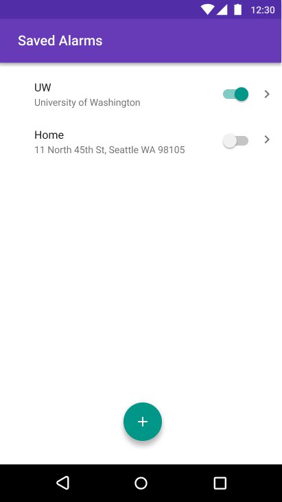
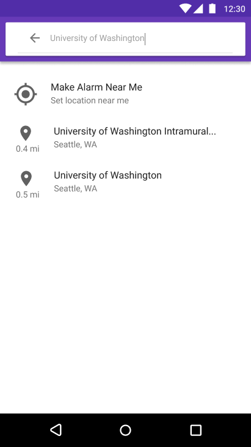
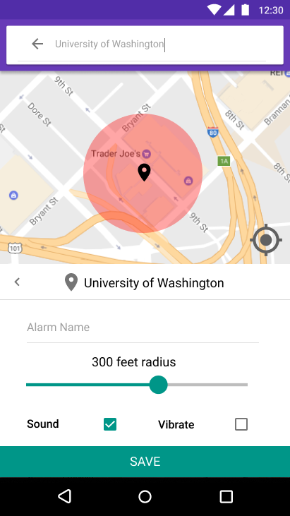
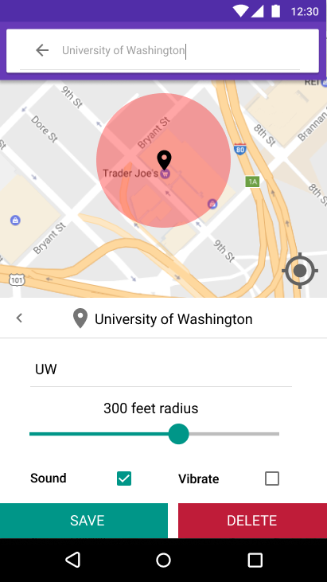
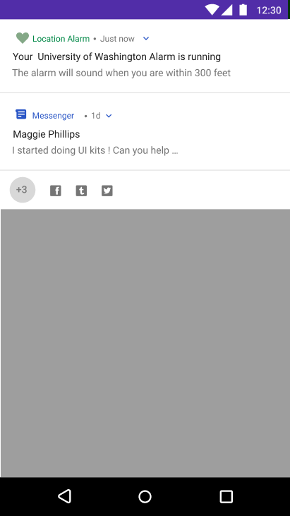
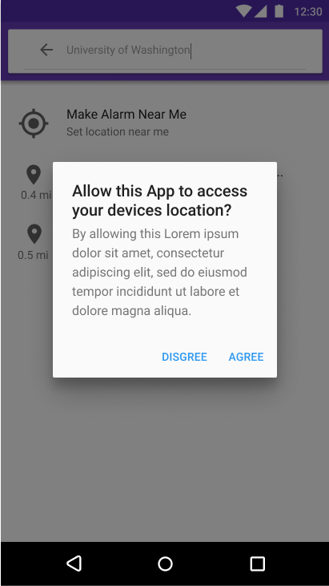

# Location Alarm Specification

## The Problem
Alarm-Me is a mobile application used to notify the user when they reach a certain location. It is used often by those on public transportation so that they do not miss their stops. This application is necessary because time-based alarm systems can be rendered ineffective by unexpected delays. However, Alarm-Me offers an unsatisfying user experience due to poor design, a low level of intuitiveness, and the continuous intrusion of advertisements.

We came up with the above three problems with the Alarm-Me user experience through three avenues of investigation: ratings in the Google Play Store, observation of INFO 442 classmates using the application, and scholarly papers on sentiment of mobile users towards ads.

As of 4/13/2019 at 12:30PM, Alarm-Me holds a 4.2 out of 5 rating from 632 user reviews. Most five star reviews state that the application works as expected, but some note that the process of setting an alarm is “unnecessarily complicated”[1] and many contain suggestions to improve functionality. 10 one star reviews detailed interruption of advertisements as a major concern.

In our personal observation of classmates using Alarm-Me, we noted that many faced issues with the interface. Problems included confusion between making an alarm and selecting a location, inability to cancel an alarm, and concerns with the clarity of application icons and the relative size/spacing of those icons[2].

A 2018 report found that consumers tend to accept ads in a free application. However, this sentiment does not extend to full page ads, especially if there is no ‘X’ button to quickly exit[3]. Alarm-Me is an offender for full page ads, which greatly reduces the odds that a user will continue using it.

[1]: https://play.google.com/store/apps/details?id=com.prax6apps.alarm_me&hl=en_US&reviewId=gp%3AAOqpTOFK-P0BWeIc7nKevvy0uvsIGsJcgPKZT1ACYWsA4jzSxqMmZ5DvWgoYxMCB8bI7lcTb4xpXSiyWIeCzjnE

[2]:https://docs.google.com/document/d/1tw-QYEocI5bLkRHLc8HLi1kC7uE_K6xvE3vRGIUqIf0/

[3]: https://management-datascience.org/2018/04/09/intrusive-digital-advertisingfrom-control-to-resistance/

## The Solution
Our design focuses principally on the concept of learnability, so we are prioritizing ease of use and the onboarding process to create an alarm. For this reason, we want to keep our screens and functionality simple. The app will allow the user to create and edit recurring alarms that go off once the user has reached a certain location.

### Font, Colors, Icons
Throughout our app, we use the Roboto font in different sizes. This is the font recommended by Google Material Design, and it is optimized to display well on mobile devices. Similarly, all icons are from Google Material Design since they convey well which action is associated with which icon. Colors are also lifted from Google Material Design and are the baseline theme (primary: 673AB7, secondary: 009688) that provides a good balance of clarity and aesthetic. Text/details on both the primary and secondary colors in this theme are white, and on a white background are black (grey for subscript).

### A. Initial Screen/Alarm List

This is the initial screen that is presented to the user upon opening the app. If there are no alarms, the list will be empty, otherwise alarms will be displayed in the order that they are created. Each alarm has a header that is the name of the alarm and a subscript that is the address input when creating the alarm. The slider to the right of the alarm can be tapped to enable or disable the alarm (with an accompanying slider and color change animation), with active alarms represented by the top slider in this screen and inactive represented by the bottom slider. Tapping the alarm at any point within the rectangular area allocated to each alarm (slightly above the header and below the subscript and to either side of the screen) allows the user to edit the alarm (screen D). Tapping the green plus icon allows a user to create an alarm (screen B). The ‘Saved Alarms’ title is in size 20 font, the header for each alarm is size 16, and the subscript (location) is size 14.

### B. Location Search interface

When the user goes to create a new alarm, they will be brought to a screen that allows them to search for a location using a text query to the Google Maps Search API. The matching results appear as a list with the location name, address, and distance from the user’s current location (ordered by distance from current location). Selecting an existing location takes the user to the “create an alarm” screen (screen C). At the top of the list is the option to set an alarm based on or the user’s current location. This option is visible even if the user has not entered a location input. Selecting this option also takes the user to the “create an alarm” screen (screen C). The search location text is size 14 font while the matching results (including current location) have a size 16 font header and a size 14 font subscript.

### C. Create Alarm Screen

Once the user has selected a location for the alarm, a pin will be dropped at the input location with a red circle having a default 300 feet radius (all calculated with the Google Maps API). A drawer will slide up from the bottom with alarm settings. The settings include the name of the location, an optional input section with the hint text “Alarm Name” which will set a custom name for the alarm (tapping will bring up the phone keyboard), a slider to adjust the radius around the location point (the alarm will sound once the current location is in the radius, changing this resizes the red circle) and text above the slider telling the user the current radius in feet. The user is able to check boxes to have the alarm sound and/or vibrate. The save button at the bottom will save the alarm and add it to the alarm list, taking the user back to screen A. After saving, the alarm will automatically push a notification containing information about the alarm (screen E). The user can also edit the alarm location, going back to screen B. The map view includes a current location button in the lower right which will snap the map to the user’s current location. The location search text is size 14 font, the name of the location, size of the circle radius, and save button are size 18 font, and the alarm nickname text and sound and vibrate buttons are size 16 font.

### D. Edit Alarm Screen

If a user has tapped an alarm from the list they will be taken to the edit alarm screen. This screen has the same functionality as the create alarm screen (screen C) with the exception of a delete button being added to the bottom right of the editing menu (color: BF1C39). Tapping this button will remove the alarm from the saved alarms list and the display will update accordingly (screen A). The new delete button is also size 18 font.

### E. Notification Example

If the user swipes down from the top of their screen while an alarm is active, they will be greeted with a screen similar to this one. This notification lets the user know the the Location Alarm app is running. It also lets the user know the name of the alarm, and at what distance from the destination the alarm will sound. Font size and text color is determined by the phone standards for notifications.

### F. Permissions Screen

This permissions screen appears the first time a user tries to create a location alarm. It is the standard Android permissions screen that appears whenever an application asks to access a user’s location for the first time. It allows the user to choose to either let the application access their location by clicking the word “Agree,” or refuse to allow access by clicking “Disagree.” If the user taps agree, the app will function as expected. Otherwise, the app will prompt the permissions screen every time the user attempts to tap the location search box or the current location option.
